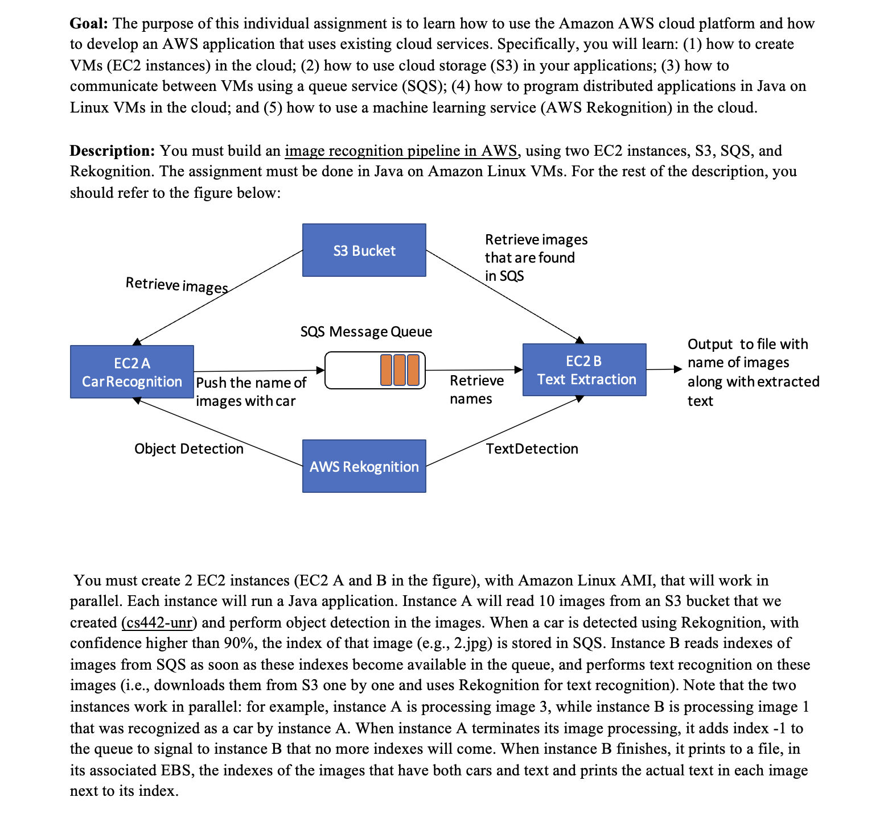
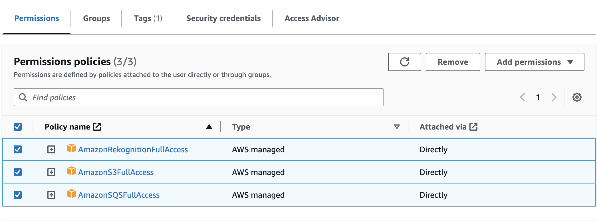
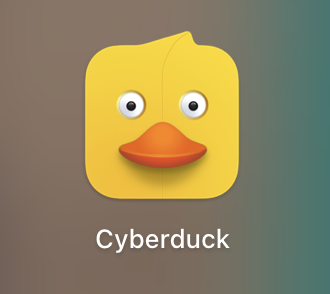
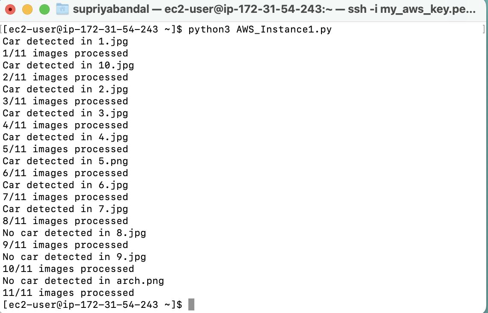
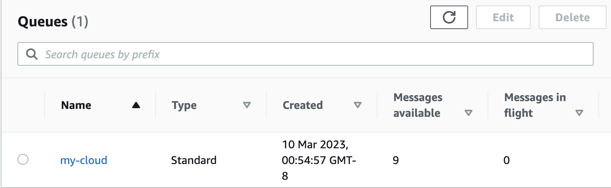
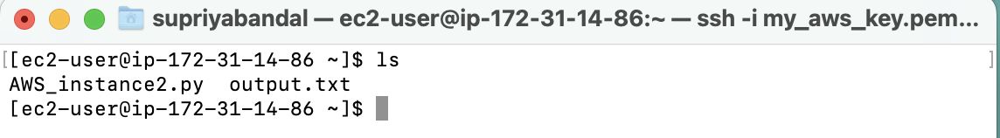
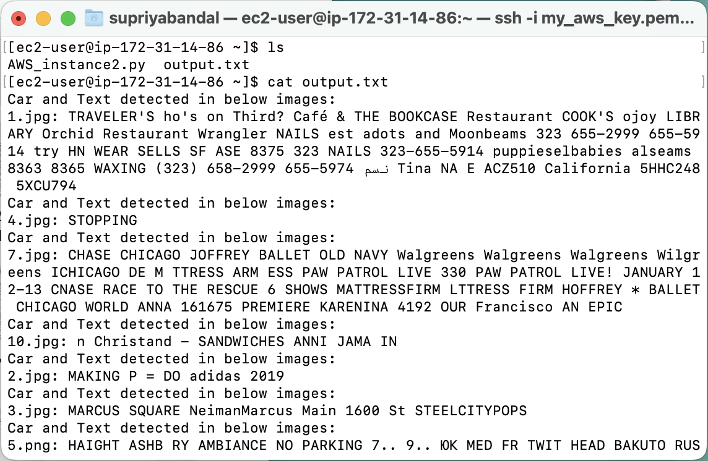

Author: Supriya Bandal

YouTube link:
1. AWS Image Rekognition Pipeline: https://www.youtube.com/watch?v=q_g15xqZraw
2. AWS Image Rekognition Services Setup: https://www.youtube.com/watch?v=QDjmqnJorMo&t=8s

# Project Problem Statement:

## To build an image recognition pipeline in AWS, using two EC2 instances, S3, SQS, and Rekognition, you can follow these steps:

# Create two EC2 instances to run both application on instances:
Create two Amazon Linux AMI instances in the same VPC, one for `Object detection` and the other for `text recognition`.
Note down the instance IDs and their public IP addresses, 

# Create an SQS queue (e.g., my-cloud) in the same region as the EC2 instances.
Note down the queue URL.

# Create an IAM user and set up the IAM roles and policies for the EC2 instances to access S3, SQS, and Rekognition.
check full access to below services while creating an User or it can be modify as well:

# Create an S3 bucket (e.g., cs442-unr) and upload some images that you want to process in the pipeline.
Make sure that the bucket is accessible to both EC2 instances.
`S3 bucket is created globally so anyone can access it if given public access to it`
Note down the bucket name and region.

# SSH connection: 
1. Open your `Terminal` to Connect to the EC2 instances using SSH. In ec2 dashboard by clicking on `connect` at top, you will get the link to copy from `SSH Client` as `ssh -i "<my.pem>" <ec2 username>@ec2-00-000-000-00.compute-1.amazonaws.com` copy this to local terminal and start your instance on your machine. 
2. Install the necessary dependencies (e.g., boto3).
3. Configure AWS on instance by using `aws configure`, provide below four information:
-Access key ID
-Secret access key
-AWS Region
-Output format

# Upload Code on Instance:
ec2 `Public IPv4 DNS` will be required to upload your python code on instance via `Cyberduck`. I am using free version of Cyberduck. Just drag .py code from your local folder to Cyberduck and it will be shown on Instance.

# Code Part:
In the Object detection code on instance A, create a connection to S3 and SQS using the boto3 library.
Iterate over the images in the S3 bucket and use the Rekognition API to detect objects in the images.
When a car is detected with confidence higher than 90%, add the index of the image to the SQS queue using the boto3 library.
When all images have been processed, add the index -1 to the SQS queue to signal to instance B that no more indexes will come. It is important to handle errors and exceptions properly in the code to ensure the pipeline runs smoothly.  
Note: Run the Object recognition application(.py) on instance A, you will get below output:

Once you run Instance 1, messages will start appearing on SQS dashboard(Message available):

In the text recognition code on instance B, create a connection to S3 and SQS using the boto3 library.
Continuously poll the SQS queue for new messages using the boto3 library.
When a new message is received which was stored by instance 1 by detetcting a `Car`, read the index and download the corresponding image from S3 and use the Rekognition API to perform text recognition on the image.
If the image contains both cars and text, write the index of the image and the text to a file(output.txt) in the associated EBS volume.

Note: Go to `Volume` to connect ec2, Volume get generated while you create ec2 Instance. You can modify it for storage or you can add another volume and connect it to ec2 instances. *(make sure to create Volume in same region as in Ec2 instances).

Output.txt will store below information:

Note: Run the Object detection application on instance A and then text recognition on instance B in parallel. *(Instance B wont work if you dont Run Instance A first).

# Terminate the EC2 instances on your local machine and clean up resources

Also, When both applications have finished, terminate the EC2 instances in `AWS` to avoid incurring unnecessary charges.
Delete the S3 bucket and the SQS queue to clean up resources.
